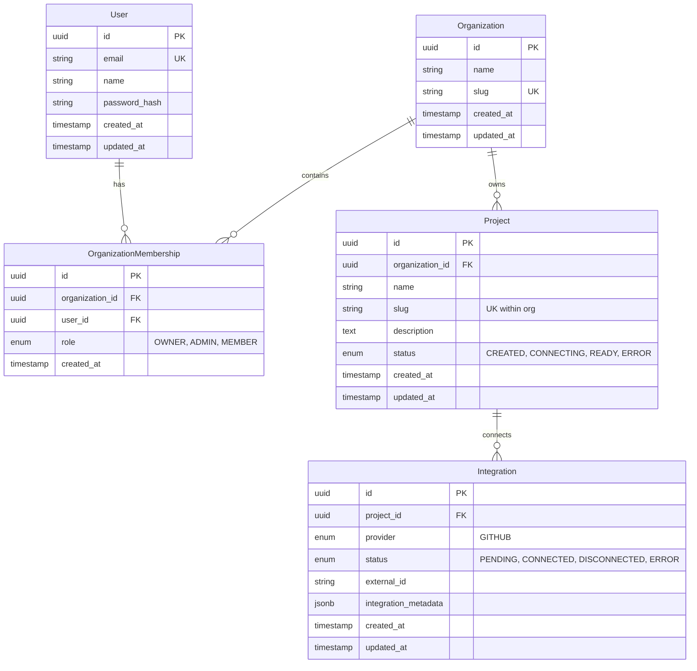

# Unotusk MVP — Stage 0 Architecture Specification
**Clean-Slate Foundation & Security Boundaries**

## 1. System Components

The Stage 0 architecture is a clean, modular monolith designed for strict multi-tenant isolation, high developer productivity, and preparation for subsequent Project Intelligence stages.

```
┌─────────────────────────────────────────────────────────────┐
│                    Client (Next.js 14+)                     │
│               App Router / Tailwind / TypeScript            │
└──────────────────────────────┬──────────────────────────────┘
                               │ HTTPS / JSON (Bearer JWT)
                               ▼
┌─────────────────────────────────────────────────────────────┐
│                   FastAPI Application                       │
│    Auth / Org Scoping / Project CRUD / Task Dispatcher      │
└──────────────┬──────────────────────────────┬───────────────┘
               │ SQLAlchemy 2.0 (asyncpg)      │ Redis Queue
               ▼                              ▼
┌──────────────────────────────┐ ┌────────────────────────────┐
│   PostgreSQL + pgvector      │ │       Redis (Queue)        │
│   Users, Orgs, Projects      │ └──────────────┬─────────────┘
│   Foreign Keys / Cascades    │                │ BRPOP
└──────────────────────────────┘                ▼
                                 ┌────────────────────────────┐
                                 │     Background Worker      │
                                 │    Task Consumer (async)   │
                                 └────────────────────────────┘
```

### Components:
- **`apps/web`**: Next.js 14 App Router frontend providing authenticated user journeys for login/signup, organization switching, project creation, and project overview.
- **`apps/api`**: FastAPI async backend strictly validating authorization boundaries, providing reproducible Alembic migrations, and offering standard error responses.
- **`packages/types`**: Shared TypeScript definitions matching backend Pydantic schemas.
- **`services/workers`**: Lightweight Python worker consuming background tasks from Redis to prove asynchronous execution without premature task engine sprawl.
- **Database**: PostgreSQL 16 with `pgvector` enabled at the system level.

---

## 2. Multi-Tenant Data Boundaries & Isolation Model

### Invariants:
1. **Zero Client Trust**: Organization IDs sent by clients are never trusted blindly. All mutations and queries require the caller's JWT `sub` (User ID) to possess an active membership (`OrganizationMembership`) in the target organization.
2. **Explicit Project Scoping**: Every project query enforces `WHERE id = :project_id AND organization_id = :org_id`.
3. **Cross-Tenant Isolation (The Golden Test)**:
   - User A in Org A cannot read, update, or delete Project B in Org B.
   - Any attempt returns `403 Forbidden` or `404 Not Found` (preventing IDOR enumeration).
   - Projects cannot be injected across organizations.
4. **Referential Integrity**:
   - Deleting an Organization cascades deletions to all its Projects, Memberships, and Integrations.
   - Deleting a User cascades deletions to their Memberships.
   - Unique constraints prevent duplicate slugs within the same organization (`uq_org_project_slug`).

---

## 3. Database Schema & Relationships



---

## 4. Authentication Boundary

- **Credential Storage**: Passwords hashed with salted `bcrypt` (12 rounds). Zero plaintext storage.
- **Session Tokens**: Stateless signed JWTs (`HS256`) containing `sub` (user UUID), `email`, and standard UTC expiration (`exp`).
- **Development Secret**: Injected strictly via environment variable `AUTH_SECRET` (never hardcoded in git).
- **Future Enterprise Extension**: The `get_current_user` dependency can seamlessly inspect OIDC identity assertions or swap token verifiers without affecting route handlers.

---

## 5. Background Task Boundary

- **Queue Mechanism**: Lightweight Redis list abstraction (`LPUSH` / `BRPOP`).
- **Lifecycle**:
  1. API endpoint receives task request (e.g. `POST /api/v1/tasks/ping`).
  2. `TaskDispatcher.enqueue` creates task record in Redis with status `QUEUED` and pushes payload.
  3. Worker pulls task, updates state to `PROCESSING`, executes logic, and writes back `COMPLETED` or `FAILED` with result payload.
  4. API callers can inspect state via `GET /api/v1/tasks/{task_id}`.
- **Stage 1 Extension**: This exact pattern hosts GitHub webhook parsing, repo cloning, and commit ingestion workers in Stage 1 without needing Kafka or Celery infrastructure yet.

---

## 6. Items Intentionally Deferred to Later Stages

- **Stage 1**: GitHub OAuth, GitHub App webhook handling, repository cloning, tree-sitter AST extraction, commit history ingestion.
- **Stage 2+**: Vector embeddings generation, pgvector similarity index, Qdrant / semantic search, ontology graph construction, AI Project Intelligence Report generation.
- **Explicitly Out of Scope**: Licensing, degraded mode, mTLS, multi-region federation, automated code rewriting.
