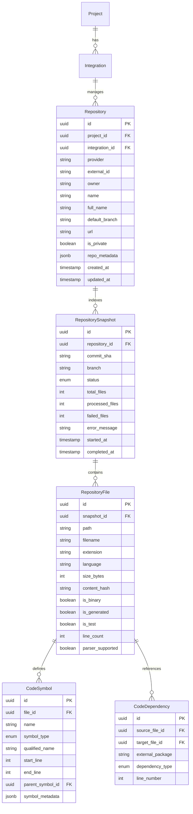

# Unotusk MVP — Stage 1 Architecture Specification
**GitHub Connection, Repository Ingestion & Project Context Foundation**

## 1. Overview

Stage 1 transforms a connected GitHub repository into structured, deterministic project context stored in PostgreSQL. It avoids LLM hallucination for factual code discovery by using deterministic file scanners and Tree-sitter AST parsers.

```
┌─────────────────────────────────────────────────────────────┐
│                    GitHub Repository                        │
└──────────────────────────────┬──────────────────────────────┘
                               │ Git Clone (depth=1)
                               ▼
┌─────────────────────────────────────────────────────────────┐
│                  File Scanner & Filter                      │
│      Excludes .git, node_modules, build, lockfiles          │
└──────────────────────────────┬──────────────────────────────┘
                               │ Source Files & Metadata
                               ▼
┌─────────────────────────────────────────────────────────────┐
│                Tree-sitter AST Parser Engine                │
│    Python, TypeScript, TSX, JavaScript, Go (Graceful Fallback)│
└──────────────┬──────────────────────────────┬───────────────┘
               │ Symbol Extraction            │ Import / Dependency Extraction
               ▼                              ▼
┌──────────────────────────────┐ ┌────────────────────────────┐
│         CodeSymbol           │ │       CodeDependency       │
│  Class, Func, Method, Type   │ │  Internal & External Pkg   │
└──────────────┬───────────────┘ └────────────┬───────────────┘
               │                              │
               └──────────────┬───────────────┘
                              ▼
               ┌──────────────────────────────┐
               │    PostgreSQL (Context)      │
               │   RepositorySnapshot: READY  │
               └──────────────────────────────┘
```

---

## 2. Relational Data Model

Every repository entity is tied back to a specific `Project` and inherits strict organization-level multi-tenant boundaries.



---

## 3. Ingestion State Machine

Ingestion execution is asynchronous, tracked through explicit transitions:

1. `QUEUED`: Job created in database, task pushed to Redis (`unotusk_tasks`). HTTP response returns immediately (`202 Accepted`).
2. `CLONING`: Worker acquires task, clones git repo with `--depth 1`.
3. `SCANNING`: File walker enumerates repository paths, applies exclusion filters, detects language heuristics, computes SHA-256 content hashes, line counts, and flags tests/binaries.
4. `PARSING`: Tree-sitter parses supported language ASTs, recursively extracting symbol hierarchies (classes, methods, functions, interfaces, types) and import statements. Unsupported files are marked `parser_supported = False` without failing the ingestion.
5. `INDEXING`: Relational dependencies are resolved (linking relative imports to local repository files or external packages) and committed. Project status transitions to `READY`.
6. `COMPLETED` / `FAILED`: Final status timestamped. If failure occurs, user-friendly error message is recorded and exposed via API without leaking stack traces.

---

## 4. API Endpoints

- `POST /api/v1/projects/{project_id}/github/connect`: Connect GitHub via PAT or environment token.
- `GET /api/v1/projects/{project_id}/github/repositories`: List accessible GitHub repositories.
- `POST /api/v1/projects/{project_id}/repositories/select`: Associate repository with project.
- `POST /api/v1/projects/{project_id}/repositories/{repository_id}/ingest`: Trigger ingestion snapshot.
- `GET /api/v1/projects/{project_id}/ingestions`: List ingestion history and active snapshots.
- `GET /api/v1/projects/{project_id}/ingestions/{snapshot_id}`: Poll granular snapshot progress.
- `GET /api/v1/projects/{project_id}/repository`: Retrieve project repository context and summary metrics.
- `GET /api/v1/projects/{project_id}/files`: List repository files with filtering.
- `GET /api/v1/projects/{project_id}/symbols`: List extracted AST symbols.
- `GET /api/v1/projects/{project_id}/dependencies`: List internal and external dependencies.
- `POST /api/v1/projects/{project_id}/repository/reindex`: Trigger re-index snapshot.

---

## 5. Security & Isolation Invariants

1. **Strict Tenant Scoping**: All repository and context queries verify project membership in caller's organization. Cross-organization access attempts return `403 Forbidden`.
2. **Credential Safety**: GitHub tokens are stored in integration metadata or environment variables; git clone URLs mask access tokens during errors (`[REDACTED]`).
3. **No Unbounded Memory Leaks**: Large files (>5MB) bypass in-memory buffering. Full file contents are not stored in PostgreSQL.
