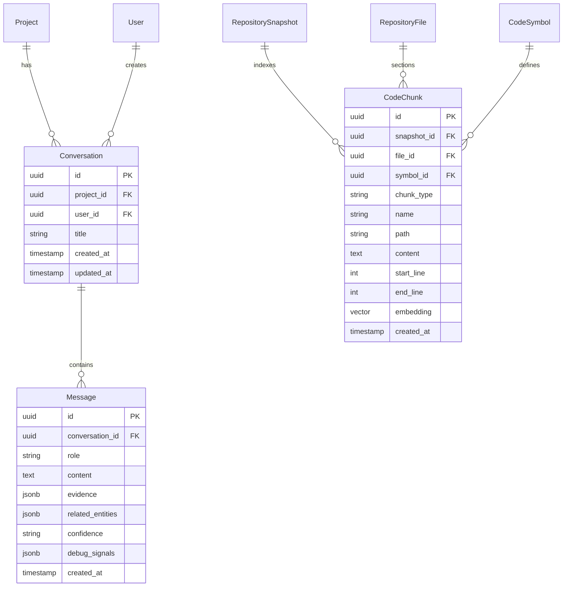

# Unotusk MVP — Stage 2 Architecture Specification
**Grounded Project Intelligence — Project Context Engine + Ask Unotusk**

## 1. Overview

Stage 2 builds the intelligence layer atop Stage 1's deterministic foundation. The user asks natural language questions about the codebase (e.g. *"How does authentication work?"*, *"Where is payment processing implemented?"*, *"What depends on the UserService?"*), and Unotusk responds with evidence-grounded answers citing repository files, AST symbols, code snippets, and dependencies.

```
                         User Question
                              │
                              ▼
                    [1. Query Analyzer]
          (Keywords, symbols, file paths, concepts)
                              │
                              ▼
                    [2. Hybrid Retrieval]
   ┌──────────────────┬──────────────────┬──────────────────┐
   ▼                  ▼                  ▼                  ▼
[File Search]  [Symbol Search]   [Content Search]   [Dependency Search]
   └──────────────────┼──────────────────┼──────────────────┘
                              │
                              ▼
                [3. Relationship Expansion]
          (Symbol -> File -> Dependencies -> Neighbors)
                              │
                              ▼
                   [4. Multi-Signal Ranker]
             (Lexical + Symbol + Graph Proximity)
                              │
                              ▼
               [5. Context Budget & Assembler]
           (Prioritize evidence within token limit)
                              │
                              ▼
                   [6. Claude 3.5 Sonnet]
             (Dedicated System Prompt: Grounded,
              Zero Hallucination, Exact Citations)
                              │
                              ▼
                  [7. Grounded Answer Model]
         - Structured Explanation
         - Evidence Items (files, symbols, lines, snippets)
         - Related Entities
         - Confidence (HIGH / MEDIUM / LOW)
         - Retrieval Debug Diagnostics
```

---

## 2. Relational Data Model (Stage 2 Extensions)



---

## 3. The Multi-Signal Context Engine

### Step 1: Query Analysis (`query_analyzer.py`)
- Tokenizes natural language queries while removing semantic stop words.
- Heuristically identifies code entities:
  - CamelCase identifiers (e.g. `AuthService`, `UserService`, `UserCreate`)
  - snake_case functions and methods (e.g. `create_user`, `handle_webhook`)
  - Explicit file paths and extensions (e.g. `src/auth.py`, `.ts`)
- Expands domain architectural synonyms (`auth` $\rightarrow$ `jwt`, `token`, `session`, `password`).

### Step 2: Multi-Signal Retrieval (`retriever.py`)
Searches the active snapshot simultaneously across four deterministic vectors:
1. **File Search**: Exact and prefix matches on file paths and filenames.
2. **Symbol Search**: Case-insensitive and qualified name matches against parsed AST symbols.
3. **Content / Chunk Search**: Substring matches against code snippet bodies in `code_chunks`.
4. **Dependency Search**: External package and imported module matching.

### Step 3: Structural Relationship Expansion (`graph_expander.py`)
Traverses 1 hop across the code knowledge graph:
- If a relevant symbol is matched, its enclosing file and its imported dependencies are retrieved.
- If a relevant file is matched, its declared symbols and downstream dependents are pulled into the context.

### Step 4: Multi-Signal Ranking (`ranker.py`)
Scores candidates on a normalized 0.0–1.0 scale combining:
$$\text{Score} = w_{\text{sym}} \cdot S_{\text{sym}} + w_{\text{file}} \cdot S_{\text{file}} + w_{\text{content}} \cdot S_{\text{content}} + w_{\text{dep}} \cdot S_{\text{dep}} + w_{\text{graph}} \cdot S_{\text{graph}} + \text{Bonus}_{\text{exact}}$$

### Step 5: Context Budgeting & Formatting (`assembler.py`)
Deduplicates evidence, caps individual snippet lengths, and compiles a clean, formatted Markdown context strictly adhering to `CONTEXT_BUDGET_TOKENS` (default 16,000 tokens / 64,000 characters).

---

## 4. LLM Grounding & System Prompt

- **Provider**: Explicit `ClaudeProvider(LLMProvider)` with `anthropic` SDK integration using `claude-3-5-sonnet-20241022` (or `claude-3-5-haiku-20241022`).
- **Offline / Test Mode**: Provides a deterministic offline synthesizer when `ANTHROPIC_API_KEY` is not present, ensuring automated test suites and CI run with 100% reliability.
- **Strict Grounding Rules**:
  - Ground factual claims **exclusively** on the provided project context.
  - Never invent files, functions, dependencies, or architectural components.
  - Distinguish observed code facts from logical inferences.
  - Explicitly acknowledge missing evidence or gaps.
  - Provide evidence citations (file paths, symbol names, line coordinates) and assess confidence (`HIGH`, `MEDIUM`, `LOW`).

---

## 5. API Endpoints

- `POST /api/v1/projects/{project_id}/ask`: Standalone or threaded grounded Q&A.
- `POST /api/v1/projects/{project_id}/conversations`: Create persistent conversation thread.
- `GET /api/v1/projects/{project_id}/conversations`: List project conversations with message counts.
- `GET /api/v1/projects/{project_id}/conversations/{conversation_id}`: Retrieve dialogue turns and evidence audits.
- `POST /api/v1/projects/{project_id}/conversations/{conversation_id}/messages`: Continue conversation thread.
- `POST /api/v1/projects/{project_id}/context/search`: Developer debug endpoint inspecting raw retrieval signals and candidate rankings.

All endpoints verify organization membership and enforce strict multi-tenant project isolation (returns `403 Forbidden` on unauthorized cross-tenant requests).
