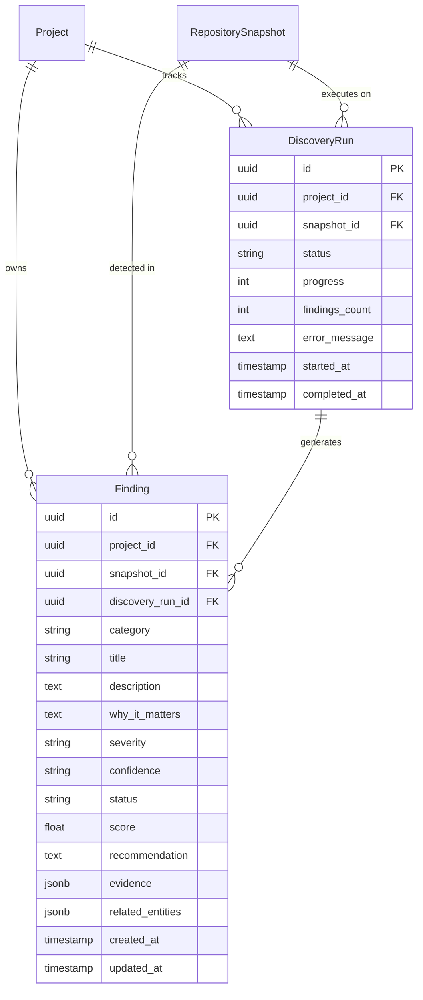

# Unotusk MVP — Stage 3 Architecture Specification
**Project Discovery Engine — "I Found Something You Should Know"**

## 1. Overview

Stage 3 adds proactive intelligence to Unotusk. The user no longer needs to query the system to uncover problems or architectural drift. Upon project indexing, the Proactive Project Discovery Engine executes a multi-analyzer deterministic inspection across AST symbols, dependency graphs, file structures, and code chunks to uncover:

- High-coupling architectural hotspots
- Circular dependencies (cycles in component imports)
- Change risk hotspots (high fan-in with complex fan-out)
- Unused/dead code (unreferenced private symbols)
- Documentation gaps (high-impact public interfaces lacking docstrings)
- Duplicate logic (high structural and naming similarity)
- Architecture boundary violations (e.g. production code importing test harnesses or frontend importing database modules)
- Legacy components (multi-signal deprecated and superseded patterns)
- Test gaps (domain source modules without corresponding test coverage)

Every discovered item is backed by project evidence (file, symbol, lines, snippet, relationship, metrics) and includes actionable synthesis: **What We Found**, **Why It Matters**, and **Recommendation**.

```
                           Repository Context
                      (Files, Symbols, Dependencies)
                                    │
                                    ▼
                    [Project Discovery Engine Pipeline]
   ┌────────────────────────────────┼────────────────────────────────┐
   ▼                                ▼                                ▼
[Circular Dependencies]   [Coupling & Hotspots]             [Change Risk]
   ▼                                ▼                                ▼
[Unused Code]             [Documentation Gaps]              [Duplication]
   ▼                                ▼                                ▼
[Architecture Boundaries] [Legacy Components]               [Test Gaps]
   └────────────────────────────────┬────────────────────────────────┘
                                    │
                                    ▼
                       [Deduplicator & Entity Keys]
                                    │
                                    ▼
                     [Deterministic Severity Ranker]
                                    │
                                    ▼
                    [Evidence Synthesizer (Claude/Rule)]
                       - What We Found
                       - Why It Matters
                       - Recommendation
                                    │
                                    ▼
                     [PostgreSQL Persistence Layer]
                      - findings (OPEN/ACK/RESOLVED)
                      - discovery_runs (QUEUED -> COMPLETED)
                                    │
                                    ▼
                   [UI & Grounded Ask Investigation Bridge]
               Click [Investigate] -> Auto-queries Stage 2 Grounded Ask
```

---

## 2. Relational Data Model (Stage 3 Extensions)



### Finding Categories
- `CIRCULAR_DEPENDENCY`: Cycle detected in dependency graph ($A \rightarrow B \rightarrow C \rightarrow A$).
- `COUPLING`: Hotspot component with excessive in-degree dependencies.
- `CHANGE_RISK`: High fan-in component combined with high fan-out complexity.
- `UNUSED_CODE`: Unreferenced symbols/functions in internal modules.
- `DOCUMENTATION_GAP`: Public/high-impact functions/classes lacking docstrings.
- `DUPLICATION`: Structural or near-duplicate function implementations across modules.
- `ARCHITECTURE`: Layering violations (e.g. cross-tier imports).
- `LEGACY`: Multi-signal legacy pattern requiring $\ge 2$ indicators.
- `TEST_GAP`: Core business logic or domain modules with no associated tests.

### Finding Status Workflow
- `OPEN` (Default state upon detection)
- `ACKNOWLEDGED` (Acknowledged by engineering team as expected/tolerated)
- `RESOLVED` (Fixed or validated as remediated)
- `DISMISSED` (False positive or intentionally ignored)

---

## 3. Analyzer Pipeline

All analyzers are deterministic-first. They inspect the parsed AST symbols and dependency graph:

1. **Circular Dependency Analyzer**: Uses depth-first cycle search on the file-to-file and module-to-module dependency graph, canonicalizing cycle paths to avoid duplicates.
2. **Coupling Analyzer**: Calculates component in-degree (consumer count). Flags components with $\ge 6$ consumers as Medium, and $\ge 15$ consumers as High.
3. **Change Risk Analyzer**: Evaluates change propagation risk by identifying components with high fan-in ($\ge 4$ consumers) combined with structural complexity ($\ge 3$ dependencies or $\ge 5$ symbols).
4. **Unused Code Analyzer**: Conservative dead code detection. Inspects internal symbols with no references across imports, symbols, or code chunks, while strictly excluding entry points (`main`, `app`, `index`, `handler`), lifecycle methods, and test fixtures.
5. **Documentation Gap Analyzer**: Detects central/public symbols ($\ge 2$ consumers) lacking docstrings and project documentation.
6. **Duplication Analyzer**: Detects logic duplication across symbols using structural and token similarity metrics ($\ge 78\%$ similarity).
7. **Architecture Analyzer**: Enforces boundary rules, flagging production code importing test helpers or frontend presentation layers importing backend persistence modules.
8. **Legacy Analyzer**: Multi-signal legacy detection requiring at least 2 distinct signals (naming prefixes like `old_`/`legacy_`, `@deprecated` comments, or the presence of a clean sibling module).
9. **Test Gap Analyzer**: Identifies source files in core domain paths that have no corresponding test files.

---

## 4. Grounded Ask Investigation Bridge

A core principle of Stage 3 is seamless navigation between discovery and grounded intelligence:
- Every finding card in the UI contains an **[Investigate]** action.
- Clicking **[Investigate]** transitions the user directly to the **Ask Unotusk** interface (Stage 2).
- The question is automatically constructed with the finding's context, description, and "Why It Matters" analysis:
  ```
  "Investigate discovery finding: <Title>. <Why It Matters> What is the root cause and how should we address it?"
  ```
- The Stage 2 Grounded Project Context Engine processes the inquiry, retrieving the exact symbols and evidence to produce an interactive remediation explanation.

---

## 5. Background Task Processing

- **Task Dispatcher**: Enqueues discovery tasks via Redis (`discover_project`).
- **Worker**: Loads project repository snapshot, instantiates `ProjectDiscoveryEngine`, runs all 9 analyzers, deduplicates, scores, synthesizes, and commits findings to PostgreSQL.
- **Progress Tracking**: Updates `DiscoveryRun.progress` (0% to 100%) and `DiscoveryRun.status` (`QUEUED` $\rightarrow$ `ANALYZING` $\rightarrow$ `FINALIZING` $\rightarrow$ `COMPLETED`).
