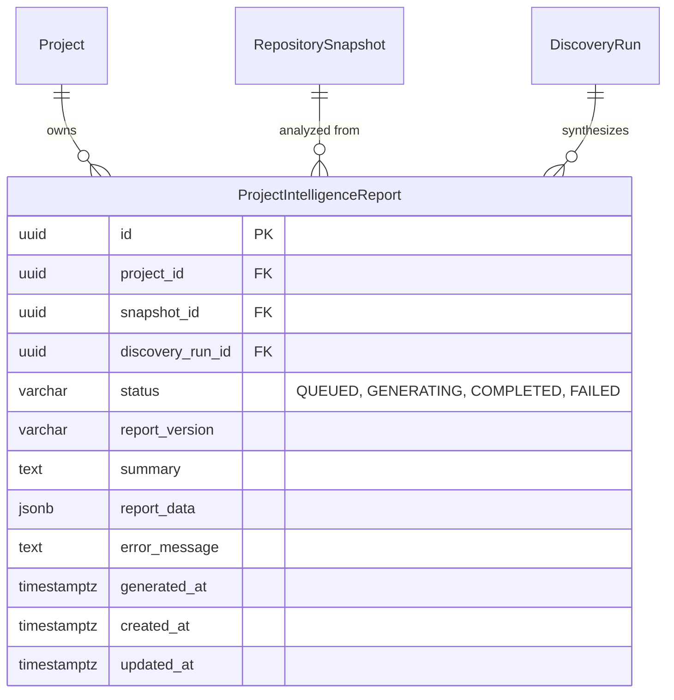

# Unotusk MVP — Stage 4 Architecture Specification
**Complete Project Intelligence Report — "Here Is What You Should Know About This Project"**

## 1. Overview

Stage 4 synthesizes the outputs of Stage 1 (AST symbols, files, dependency graph, languages), Stage 2 (grounded context, retrieval, evidence linking), and Stage 3 (proactive findings, rankings, severities) into the flagship artifact: the **Complete Project Intelligence Report**.

The report answers:
> *"What is actually going on in this project, what should I care about, why does it matter, and what should I do next?"*

Target reading time is **5–10 minutes**. It is concise, evidence-backed, actionable, inspectable, and completely grounded in the repository. It avoids generic AI-written filler and arbitrary fabricated scores.

```
                  Stage 1: Repo Context (Files, Symbols, Deps)
                  Stage 2: Evidence & Grounded Retrieval
                  Stage 3: Proactive Findings & Risk Hotspots
                                    │
                                    ▼
                         [Report Generation Pipeline]
                                    │
                                    ▼
                          [1. Fact Builder]
                   Deterministic AST, graph, & finding extraction
                                    │
                                    ▼
                       [2. Interpretation Engine]
            Classify into OBSERVED, DERIVED, and RECOMMENDED
                                    │
                                    ▼
                     [3. Constrained Synthesizer]
            Claude 3.5 Sonnet (Evidence-Restricted) OR
            Deterministic Offline Fallback (Zero Hallucination)
                                    │
                                    ▼
                    [4. Database Persistence Layer]
            PostgreSQL: project_intelligence_reports (JSONB)
                                    │
                                    ▼
               [5. Frontend Flagship Tab & Ask Bridge]
         Sub-nav, Visual Trust Badges, Evidence Modal, &
         [Investigate with Grounded Ask] bridging to Stage 2
```

---

## 2. Critical Trust Model

Every substantive claim in the report is strictly classified into one of three knowledge classes:

| Class | Definition | Visual Indicator | Inspectability |
| :--- | :--- | :--- | :--- |
| **OBSERVED** | Fact directly established from repository evidence (e.g. `AuthService has 17 consumers`, `payments.py imports database.py`). | **FACT** (Green badge) | Links directly to file path, symbol, line number, and code snippet. |
| **DERIVED** | An interpretation or conclusion deduced from observed facts (e.g. `AuthService coupling creates high downstream regression risk`). | **INTERPRETATION** (Blue badge) | Identifies the specific observed evidence from which the conclusion was drawn. |
| **RECOMMENDED** | An actionable engineering suggestion proposed by Unotusk (e.g. `Consider extracting a domain service boundary`). | **SUGGESTION** (Purple badge) | Links to the underlying finding and problem context. Never mutates external systems. |

---

## 3. Report Structure (10 Major Sections)

1. **Executive Summary**:
   - High-level project summary and deterministic state assessment (`Elevated Risk`, `Moderate Risk`, `Low Risk`).
   - Vital metrics: files, symbols, dependencies, and discoveries count.
   - Top Things to Know: highest-priority observations and derivations.
   - Immediate Next Actions: prioritized list of engineering suggestions.
2. **Project Understanding**:
   - Primary languages, total lines of code, directory layout, major modules, and detected architectural boundaries (API, Domain, Persistence).
   - Honest uncertainty: notes if business domain purpose cannot be established purely from code.
3. **What Unotusk Observed**:
   - Concise inventory of observed facts with direct evidence references.
4. **Top Discoveries**:
   - Prioritized Stage 3 findings sorted by severity (`CRITICAL`, `HIGH`, `MEDIUM`).
   - Each discovery displays *What We Found*, *Why It Matters*, *Evidence*, *Confidence*, and *Recommendation*.
   - Direct link to "View all discoveries" in the Stage 3 Discoveries tab.
5. **Risk Areas**:
   - Findings categorized into Architecture, Coupling, Dependencies, Change Risk, Legacy, Testing, Documentation, and Duplication.
6. **Technical Debt Signals**:
   - Deterministic debt signals showing Signal, Evidence, Likely Impact, and Priority.
7. **Important Dependencies**:
   - High fan-in modules (structural hotspots), high fan-out modules, circular dependency cycles, and external third-party packages.
8. **Test & Documentation State**:
   - Modules lacking test coverage and high-impact public interfaces lacking docstrings.
9. **Next Actions**:
   - Ranked, actionable list of recommendations with evidence citations.
10. **Evidence & Investigation**:
    - Every claim and discovery provides a `[View Evidence]` modal and an `[Investigate with Grounded Ask]` bridge that pre-fills Stage 2 Grounded Ask.

---

## 4. Relational Data Model

Implemented in `apps/api/src/models/report.py` and migration `0005_stage_4_reports.py`:



---

## 5. API Endpoints

All endpoints require JWT bearer authentication and strictly enforce organization and project tenant boundaries (`403 Forbidden` on unauthorized cross-tenant attempts):

- `POST /api/v1/projects/{project_id}/reports`: Triggers report generation (asynchronously via Redis worker or fallback in-process).
- `GET /api/v1/projects/{project_id}/reports`: Lists all generated reports for the project.
- `GET /api/v1/projects/{project_id}/reports/latest`: Fetches the most recent completed report.
- `GET /api/v1/projects/{project_id}/reports/{report_id}`: Fetches a specific report by ID.

---

## 6. Verification and Test Suite

- **Unit Tests (`tests/unit/test_report_engine.py`)**:
  - Deterministic interpretation engine claim generation and knowledge class assignment.
  - Offline synthesizer fallback when Anthropic API key is unset.
  - Resilience against malformed or invalid AI outputs.
  - Constrained AI synthesis when valid response is provided.
- **API Tests (`tests/api/test_reports_api.py`)**:
  - Report lifecycle (trigger, list, get latest, get by ID).
  - Cross-organization tenant isolation (bidirectional 403 checks).
  - Unauthenticated access rejection (401).
- **Golden Project Integration Test (`tests/integration/test_report_golden.py`)**:
  - Ingests a fixture project with known coupling hotspots (`AuthService`), circular dependencies (`mod_a` -> `mod_b` -> `mod_c` -> `mod_a`), test gaps (`payment.processor`), and legacy signals (`old_routine.py`).
  - Asserts that all expected facts are correctly captured in the report.
  - Strictly verifies that no fabricated files or symbols exist in the report evidence.
